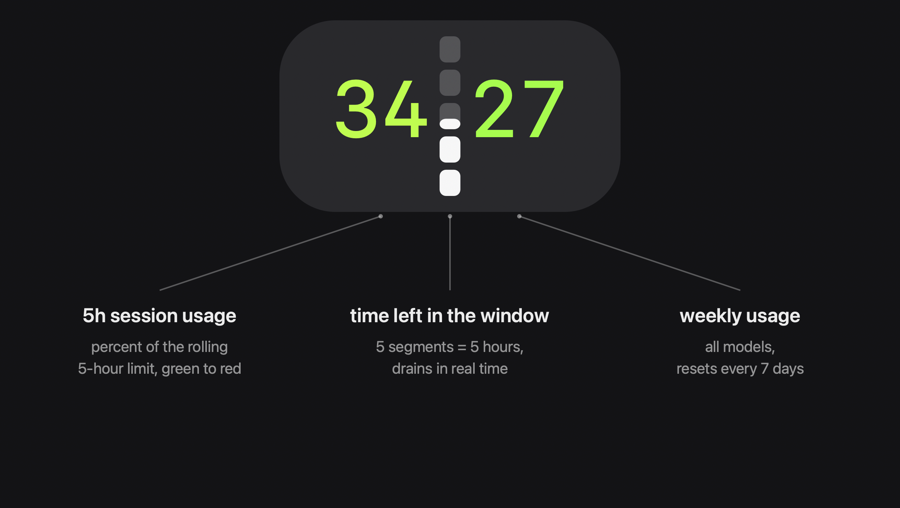
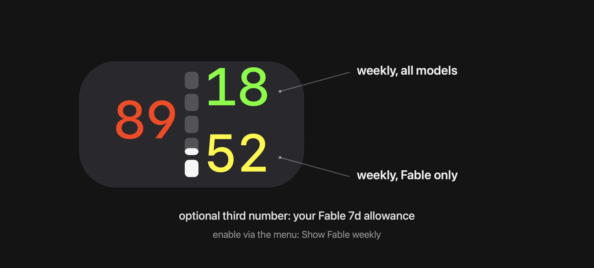

# Claude Allowance

**Track your Claude limits in the menu bar.**


Always-visible Claude allowances: **5h session usage**, **weekly usage**, and a notched gauge showing **exactly how much of your 5-hour window is left**.

If your work runs on Claude (Claude Code, Desktop, claude.ai) on a Pro/Max subscription, the limits are invisible until you slam into one mid-task. This keeps them one glance away, updated every minute, whether or not any Claude client is running.

In the wild, actual size:




## Features

- 5h and 7d utilization percentages, colored green → red
- Time gauge notched into 5 hour-segments: the bright fill is the exact time remaining in your current 5h window, draining in real time
- Optional third number: your model-scoped (Fable) weekly allowance
- Dropdown with exact percentages and reset countdowns
- Dims when data is stale; projects a rolled-over window to 0% instead of showing ghosts
- Primary data source costs **zero quota**; a 1-token probe keeps the bar alive as a fallback
- Single-file Swift app, no dependencies, built and ad-hoc signed locally by the installer

## Requirements

- macOS 13+
- Xcode Command Line Tools (`xcode-select --install`)
- A Claude **Pro or Max** subscription, signed in via the Claude Code CLI at least once (`claude` in a terminal)

## Install

```bash
git clone https://github.com/Strygah/claude-allowance.git ~/.claude/usage-bar
cd ~/.claude/usage-bar
./install.sh
```

The install location must be `~/.claude/usage-bar` — the app and updater reference it internally, and `install.sh` enforces this.

`install.sh` compiles the app and installs two LaunchAgents:

| Agent | Job |
|---|---|
| `com.claude.usage-bar` | Runs the updater every 60s, keeps `~/.claude/rate-limits.json` fresh even when no Claude client is open |
| `com.claude.usage-bar.app` | Starts the menu bar app at login, relaunches it on crash (a clean Quit is honored) |

If the bar shows `--|--`: sign in once with `claude` in a terminal, then click the item → **Refresh now**.

Optional resilience: `./provision-setup-token.sh` provisions a ~1-year token (via `claude setup-token`) so the indicator survives keychain-token expiry during desktop-app-only stretches. Without it the bar simply dims until you use the CLI again.

**Upgrade:** `git pull && ./install.sh` &nbsp;·&nbsp; **Uninstall:** `./uninstall.sh`

## How to read it

| Display | Meaning |
|---------|---------|
| `34⣿27` vivid | Fresh data — 5h=34%, 7d=27%. The middle column is the 5h window clock: bright fill = exact time remaining (drains downward), each of the 5 segments = 1 hour, faint track = full extent. |
| `34⣿27/37` | "Show Fable weekly" toggled on: the right column stacks all-models weekly (top) over Fable-only weekly (bottom). |
| thin plain bar in the middle | No active 5h window (nothing to count down). |
| dimmed | Cache is >5 min old (updater failing — check `launchctl list \| grep usage-bar`) or the shown value is a projected rollover awaiting fresh confirmation. |
| `--\|--` | No cache yet. Sign in via `claude`, then Refresh now. |



### Fable weekly (optional)

Max plans carry a model-scoped weekly limit alongside the all-models one (currently scoped to Fable). The rich usage endpoint exposes it; the bar can show it as a third number, toggled via the menu item **Show Fable weekly** (off by default). The dropdown row appears whenever the data exists, regardless of the toggle.

Scoped data comes only from the primary endpoint (keychain token). On probe-fallback data it is carried for up to 6h from its last real fetch, then ages out and the bar reverts to two numbers.

## Architecture

Two pieces plus two LaunchAgents:

| Piece | When it runs | What it does |
|-------|--------------|--------------|
| `update-rate-limits.sh` | Every 60s (LaunchAgent) + on demand from the app | Fetches usage data (see Data sources) and writes `~/.claude/rate-limits.json`. Never calls an OAuth refresh endpoint, never writes the keychain. |
| `usage-to-cache.py` | Called by the updater | Parses the rich usage payload into the cache (incl. the scoped weekly) and appends a deduped history for your own analysis. |
| `ClaudeUsageBar.swift` | Always (menu bar app) | Pure UI: reads the cache every 15s and on menu open. No network, no keychain. Renders the whole item as one 22pt image (text attachments clip at the font's line box). |
| `restart.sh` | Dev loop | Rebuild + relaunch through launchd (`kickstart`), converging to exactly one instance — replacing a running app's binary can trip Gatekeeper's stale-signature kill and launchd's KeepAlive relaunch race. |

### Why this shape

macOS periodically re-attests ad-hoc-signed apps that read OAuth-class keychain items, prompting for the login password several times a day. The fix: the menu bar app **never touches the keychain**. All keychain access goes through `/usr/bin/security` (Apple-signed, trusted in the item's ACL) inside the updater script, which reads silently from any context, including a background LaunchAgent.

## Data sources

Priority order in the updater:

1. **`GET /api/oauth/usage`** with the keychain OAuth token (needs the `user:profile` scope). A pure usage query: costs **no quota** and returns rich data — exact utilizations, ISO reset times, per-model weekly buckets. Requires a `User-Agent: claude-code/<ver>` prefix or the endpoint 429s.
2. **Fallback probe:** a `max_tokens: 1` call to `/v1/messages`, reading the `anthropic-ratelimit-unified-*` response headers. Works with a long-lived `claude setup-token` (which lacks the scope for source 1). Costs 1 output token per minute against the very limit it measures — negligible, but real.

### OAuth gotcha (if you hack on this)

Subscription OAuth tokens (`sk-ant-oat-*`) must be sent as `Authorization: Bearer` **plus** `anthropic-beta: oauth-2025-04-20`. Passing them via `x-api-key` returns a silent 401. Rate-limit data is only available via response headers or the usage endpoint:

```
anthropic-ratelimit-unified-5h-utilization: 0.43
anthropic-ratelimit-unified-7d-utilization: 0.56
anthropic-ratelimit-unified-5h-reset: 1779571800
anthropic-ratelimit-unified-7d-reset: 1779883200
```

Both 200 and 429 responses carry these headers (a 429 reports the exhausted window).

## Disclaimer

Not affiliated with or endorsed by Anthropic. This tool reads **unofficial endpoints and headers** observed from official clients; Anthropic may change or remove them at any time, at which point the bar dims until the tool is updated. It never writes to your keychain and never refreshes tokens — it only reads what official clients maintain.

## Known limits

- Requires a subscription (Pro/Max) sign-in; API-key accounts have different rate-limit surfaces this tool doesn't read.
- The optional `setup-token` file lives in plaintext under `~/.claude/usage-bar/`, mode 600, gitignored. Same blast radius as your shell history.
- If the keychain token expires and no setup-token is provisioned, the bar dims until you use the Claude Code CLI again.
- Ad-hoc signed: a fresh macOS install may require allowing the app under System Settings → Privacy & Security on first launch.

## Files

- `ClaudeUsageBar.swift` — the app (single file, pure UI)
- `build.sh` — compiles to an `.app` bundle, ad-hoc signs it
- `install.sh` / `uninstall.sh` — LaunchAgent setup / removal
- `restart.sh` — rebuild + relaunch for development
- `update-rate-limits.sh` — data fetcher (keychain via `/usr/bin/security`)
- `usage-to-cache.py` — rich-payload parser + local usage history
- `provision-setup-token.sh` — optional ~1-year fallback token
- `setup-token-test.sh` — diagnostic comparing token sources

## License

[MIT](LICENSE)
